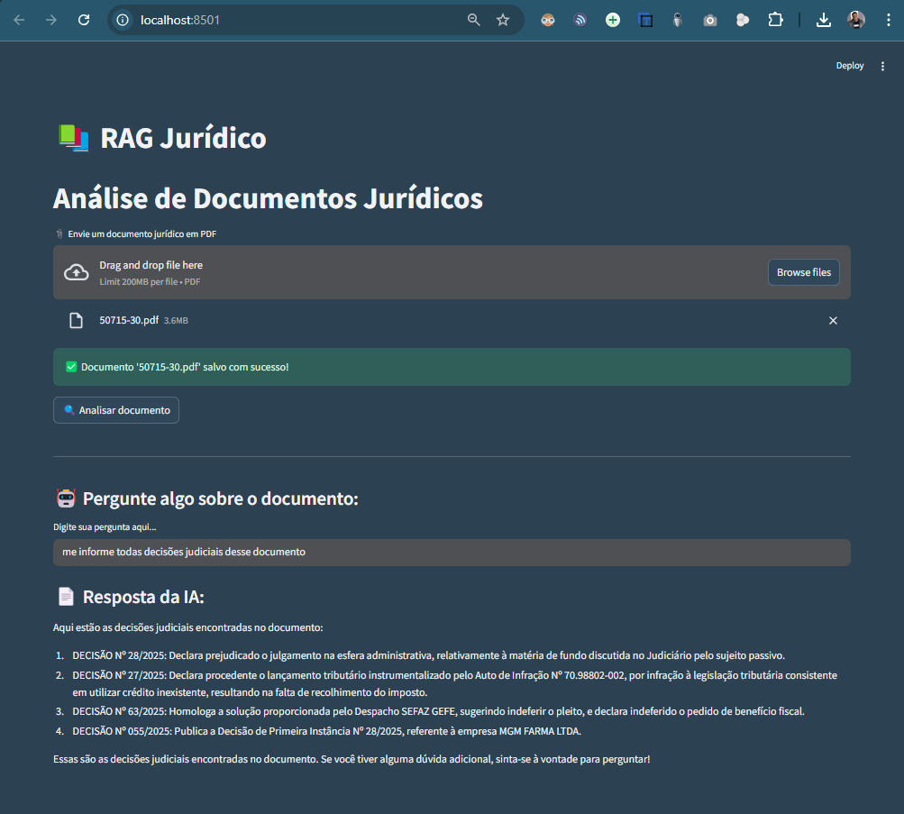

# ⚖️ LegalMentor

**LegalMentor** é um sistema inteligente de análise jurídica baseado em **RAG (Retrieval-Augmented Generation)**. Evolução direta do projeto *rag_juridico*, esta nova versão oferece uma base profissional para copilotos jurídicos com uso de IA generativa, integração com **Claude Sonnet 4**, embeddings contextuais, vetorização com **Pinecone** e futura compatibilidade com o protocolo **MCP da Anthropic**.

---

## 🚀 Objetivo

Desenvolver uma solução robusta para leitura, análise e resposta contextual de documentos jurídicos em linguagem natural, com foco em:

- Eficiência na consulta de contratos, pareceres, decisões e leis.
- Assistência jurídica automatizada via LLM.
- Arquitetura modular e escalável para futuros upgrades (LangGraph, multimodalidade, SaaS, etc).

---

## 📸 Exemplo do Sistema



---

## 🌐 Demonstração em Vídeo do Rag Jurídico

🔗 [Veja o projeto em ação no LinkedIn](https://www.linkedin.com/feed/update/urn:li:activity:7326319147112402945/)

---

## 🧠 Tecnologias Utilizadas

- **Python 3.10+**
- **Streamlit** (Interface)
- **LangChain** (Orquestração RAG)
- **Claude Sonnet 4** (via API da Anthropic)
- **Pinecone** (Vectorstore vetorial com embeddings integrados)
- **Docling** (Processamento semântico de PDFs)
- **HuggingFace Embeddings** (`multilingual-e5-large`)
- **Pytest** (testes automatizados)

---

## 📁 Estrutura do Projeto

```
legalmentor/
│
├── app.py                # Interface principal (Streamlit)
├── rag_pipeline.py       # Pipeline RAG com vetorização e cadeia de resposta
├── utils.py              # Funções auxiliares (metadados, logs, sanitização)
├── requirements.txt      # Bibliotecas e versões
├── README.md             # Documentação principal
│
├── assets/
│   └── layout_sistema.png
│
├── .streamlit/
│   ├── secrets.toml      # Configurações de API (Claude, Pinecone)
│   └── config.toml       # Configs de tema/execução
│
├── data/
│   ├── documentos/       # PDFs e arquivos enviados
│   └── indexes/          # Índices locais (caso FAISS seja usado em testes)
│
├── tests/
│   ├── test_pipeline.py  # Testes de fluxo principal
│   └── test_utils.py     # Testes de funções auxiliares
```

---

## ▶️ Como Executar Localmente

1. Crie e ative o ambiente virtual:
```bash
python -m venv .venv
source .venv/bin/activate  # Windows: .venv\Scripts\activate
```

2. Instale as dependências:
```bash
pip install -r requirements.txt
```

3. Execute o sistema:
```bash
streamlit run app.py
```

---

## 🧪 Testes Automatizados

Executar com:
```bash
pytest tests/
```

Os testes cobrem:
- Cálculo de tokens e sanitização de metadados
- Indexação vetorial e consulta contextual
- Erros controlados e fallback seguro

---

## ✅ Funcionalidades Implementadas

- [x] Upload de PDFs jurídicos
- [x] Extração semântica com Docling
- [x] Geração de embeddings contextuais
- [x] Indexação com Pinecone
- [x] Consulta jurídica com LLM (Anthropic + Claude)
- [x] Sanitização de metadados compatível com Pinecone
- [x] Testes automatizados com Pytest

---

## 🧠 Roadmap de Evolução

### 📌 Etapa Atual:
- ✅ Pinecone em vez de FAISS
- ✅ Substituir Groq por Claude Sonnet 4
- 🚧 Simulação de MCP-like com LangChain

### 🔜 Etapas Futuras:
#### 1. LangGraph (nível de agente inteligente)
- Cadeias separadas por intenção (resumo, extração, comparação)
- Persistência de estado
- Controle de fluxo conversacional

#### 2. Enriquecimento de contexto com reranking
- Re-ranking via Cohere ou bge-reranker
- Filtros semânticos por seção legal (cláusula, título, artigo)

#### 3. MCP oficial (Anthropic)
- Acesso a editores, cursor e arquivos com compreensão nativa
- RAG transformado em copiloto jurídico completo

#### 4. Autoavaliação e feedback loop
- Modelo avalia qualidade das respostas
- Ajuste dinâmico com RHF-like

#### 5. SaaS Multiusuário
- Sessões independentes por usuário
- Histórico, preferências e permissões
- Dashboards de uso e relatórios

#### 6. Multimodalidade
- Leitura de contratos escaneados (OCR)
- Upload de áudio jurídico para transcrição
- Integrações com automações (e-mails, geração de minutas, etc.)

---

## 👨‍💼 Desenvolvido por

**Mewerton de Melo Silva**  
🔗 [LinkedIn](https://www.linkedin.com/in/mewerton/)

---

## 📄 Licença

Este projeto está sob a licença MIT. Consulte o arquivo `LICENSE` para mais detalhes.
